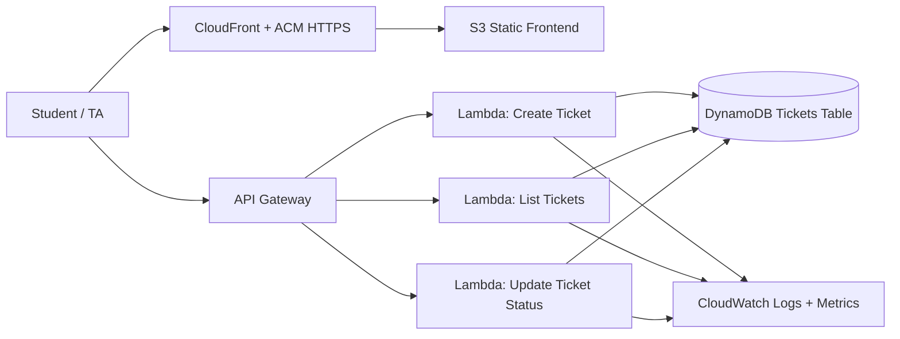

# Classroom Help Queue

Serverless classroom support queue for students and TAs.

## Project Goal

Provide a lightweight web app where students can open help tickets, and TAs can update ticket status in real time.

## Tech Stack

- Git + GitHub (branches, pull requests, history)
- GitHub Actions (CI/CD)
- Amazon API Gateway
- AWS Lambda (Node.js)
- Amazon DynamoDB
- Amazon S3
- Amazon CloudFront
- Amazon Route 53
- AWS Certificate Manager (ACM)
- Amazon CloudWatch

## Repository Structure

- `backend/`: Lambda source code and dependencies.
- `infra/`: AWS SAM template for API + functions + DynamoDB.
- `frontend/`: static web app.
- `docs/`: architecture, monitoring, and deployment checklist.
- `.github/workflows/`: CI/CD pipelines.

## API Endpoints

- `POST /tickets`: create ticket.
- `GET /tickets`: list all tickets.
- `PATCH /tickets/{ticketId}`: update status (`open`, `in_progress`, `done`).

# Architecture



## Core AWS Services

- S3: static web hosting origin for frontend files.
- CloudFront: HTTPS delivery, caching, and custom domain integration.
- API Gateway: REST endpoints for ticket operations.
- Lambda: backend business logic.
- DynamoDB: ticket storage.
- CloudWatch: logs, metrics, alarms.
- Route 53: DNS record for project subdomain.
- ACM: TLS certificates used by CloudFront.


## Local Development

### 1. Install backend dependencies

```bash
cd backend
npm install
```

### 2. Build serverless stack

```bash
cd ../infra
sam build --template-file template.yaml
```

### 3. Deploy stack

```bash
sam deploy --guided
```

After deployment, copy the API URL from stack outputs and replace `API_BASE_URL` in `frontend/app.js`.

### 4. Run frontend locally

```bash
cd ../frontend
python3 -m http.server 8080
```

Open http://localhost:8080.

## CI/CD Pipelines

- `backend-deploy.yml`: builds and deploys SAM backend on push to `main`.
- `frontend-deploy.yml`: syncs `frontend/` to S3 and invalidates CloudFront cache.

### Required GitHub Secrets / Variables

Secrets:
- `AWS_ROLE_TO_ASSUME`
- `ADMIN_PIN`

Variables:
- `AWS_REGION`
- `FRONTEND_BUCKET`
- `CLOUDFRONT_DISTRIBUTION_ID`

## DNS and HTTPS

1. Request certificate in ACM for your subdomain.
2. Attach cert to CloudFront distribution.
3. Create Route 53 alias record to CloudFront.
4. Verify HTTPS endpoint works.

## Monitoring

Monitoring design and alarms are documented in `docs/monitoring.md`.

## Architecture Diagram

See `docs/architecture.md`.

## Teacher Requirements Coverage

This project is aligned to the final-project grading requirements:

1. AWS-based working system: backend on API Gateway + Lambda + DynamoDB, frontend on S3 + CloudFront.
2. Documented GitHub repository: this README and `docs/` documentation.
3. Clear README: architecture, stack, endpoints, deployment, and monitoring sections are included.
4. CI/CD with GitHub Actions: backend and frontend deploy workflows in `.github/workflows/`.
5. Domain or subdomain: configured through Route 53 to CloudFront (see DNS/HTTPS section).
6. HTTPS: provided through ACM certificate attached to CloudFront.
7. Monitoring: CloudWatch logs, metrics, alarms, and dashboard plan in `docs/monitoring.md`.
8. Architecture diagram: provided in `docs/architecture.md`.