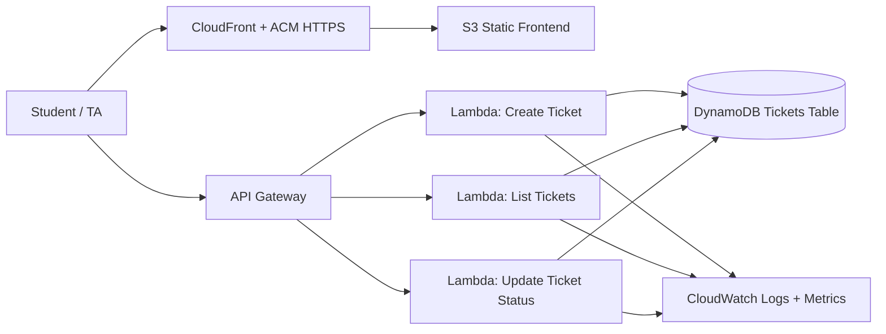

# Architecture

## Core AWS Services

- S3: static web hosting origin for frontend files.
- CloudFront: HTTPS delivery, caching, and custom domain integration.
- API Gateway: REST endpoints for ticket operations.
- Lambda: backend business logic.
- DynamoDB: ticket storage.
- CloudWatch: logs, metrics, alarms.
- Route 53: DNS record for project subdomain.
- ACM: TLS certificates used by CloudFront.
